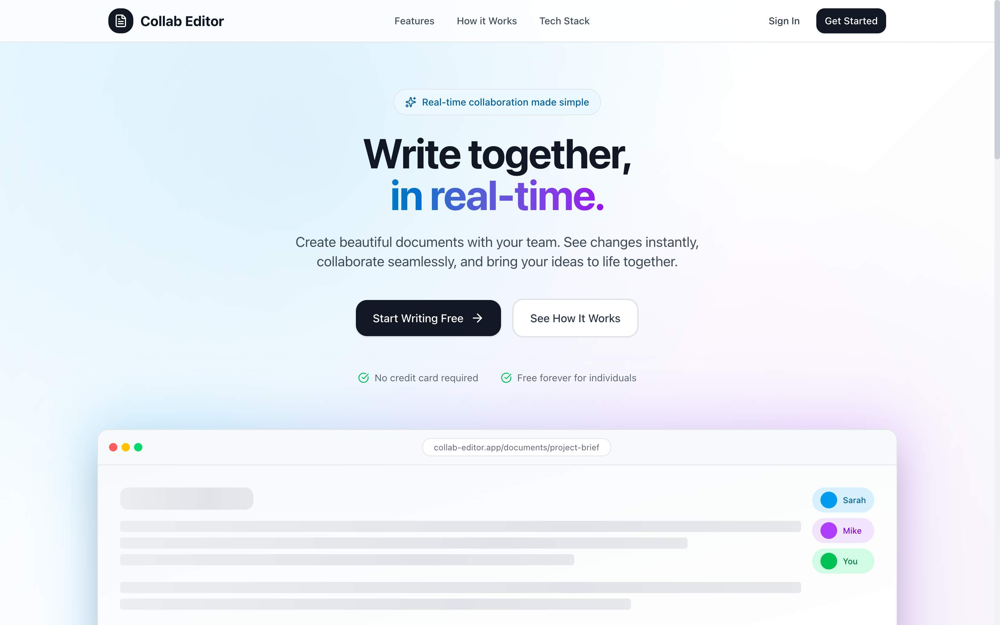
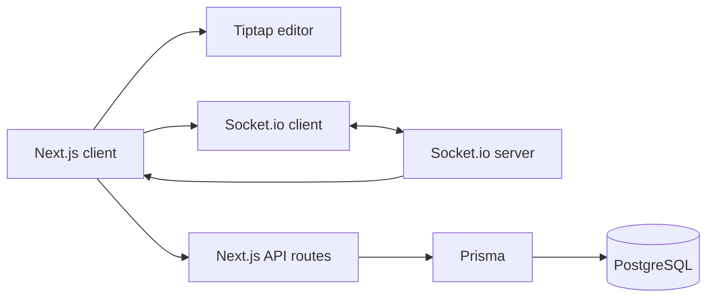

# Collab Editor

Real-time collaborative document editor with shared document rooms, presence, remote cursors, autosave, and PostgreSQL persistence.

**[Live demo](https://collab-editor-sand.vercel.app)**




## What Is Live Today

- document list and creation flow in [`src/app/documents/page.tsx`](src/app/documents/page.tsx) and [`src/app/api/documents/route.ts`](src/app/api/documents/route.ts)
- collaborative editing room in [`src/app/documents/[id]/page.tsx`](src/app/documents/%5Bid%5D/page.tsx)
- Socket.io events for `join-document`, `document-update`, and `cursor-move` in [`server/socket-server.ts`](server/socket-server.ts)
- autosave from the editor page into `PATCH /api/documents/[id]`
- auth through credentials, GitHub, and Google providers in [`src/lib/auth.ts`](src/lib/auth.ts)
- document ownership, shares, and versions in [`prisma/schema.prisma`](prisma/schema.prisma)

## Features

- **Real-Time Collaboration** - WebSocket-based room sync between connected clients
- **Rich Text Editing** - Tiptap editor with formatting, headings, lists, quotes, undo, and redo
- **Presence And Cursors** - Active-user badges and remote cursor overlays
- **Auto-Save** - Debounced persistence to PostgreSQL through the Next.js API
- **Multi-Provider Auth** - Credentials, GitHub, and Google sign-in
- **Document Management** - Create, edit, delete, and revisit saved documents

## Current Sync Model

- Edits are broadcast through Socket.io rooms to connected collaborators.
- The editor page sends local changes to the socket server and applies remote changes in the client.
- Autosave writes the current document state back to PostgreSQL through the Next.js API.
- Yjs packages are installed, but this README only claims the broadcast-and-persist flow that is implemented in the current code.

## Tech Stack

| Category | Technology |
|----------|------------|
| Framework | Next.js 16 (App Router) |
| Language | TypeScript |
| Styling | Tailwind CSS |
| Editor | Tiptap (ProseMirror-based) |
| Real-time | Socket.io |
| Database | PostgreSQL |
| ORM | Prisma |
| Auth | NextAuth.js |

## Architecture



### Real-Time Sync Flow

1. User makes an edit in the Tiptap editor
2. The client emits a `document-update` event over Socket.io
3. The socket server broadcasts the new content to the rest of the room
4. Other clients apply the remote content and update presence state
5. The editor page autosaves the latest document state through the API

## Getting Started

### Prerequisites

- Node.js 18+
- PostgreSQL database (local or cloud like Supabase)
- GitHub and Google OAuth apps if you want social sign-in

### Installation

1. Clone the repository:
```bash
git clone https://github.com/FelmonFekadu/collab-editor.git
cd collab-editor
```

2. Install dependencies:
```bash
npm install
```

3. Set up environment variables:
```bash
cp .env.example .env
```

4. Configure your `.env` file:
```env
DATABASE_URL="postgresql://..."
NEXTAUTH_SECRET="generate-with-openssl-rand-base64-32"
NEXTAUTH_URL="http://localhost:3000"
GITHUB_ID="your-github-client-id"
GITHUB_SECRET="your-github-client-secret"
GOOGLE_ID="your-google-client-id"
GOOGLE_SECRET="your-google-client-secret"
NEXT_PUBLIC_SOCKET_URL="http://localhost:3001"
NEXT_PUBLIC_APP_URL="http://localhost:3000"
```

5. Set up the database:
```bash
npm run prisma:push
npm run prisma:generate
```

6. Start the development servers:
```bash
npm run dev:all
```

This starts both the Next.js app (port 3000) and Socket.io server (port 3001).

## Project Structure

```
collab-editor/
├── src/
│   ├── app/                 # Next.js App Router pages
│   │   ├── api/             # API routes
│   │   │   ├── auth/        # NextAuth endpoints
│   │   │   └── documents/   # Document CRUD
│   │   ├── documents/       # Document pages
│   │   └── login/           # Auth pages
│   ├── components/
│   │   ├── editor/          # Tiptap editor components
│   │   └── providers.tsx    # Context providers
│   └── lib/
│       ├── auth.ts          # NextAuth configuration
│       ├── prisma.ts        # Database client
│       └── socket/          # Socket.io client hooks
├── server/
│   └── socket-server.ts     # Socket.io server
├── prisma/
│   └── schema.prisma        # Database schema
└── package.json
```

## Key Technical Decisions

### Why Tiptap?
- Built on ProseMirror, battle-tested in production
- Extensible architecture for custom functionality
- Strong collaboration ecosystem with Yjs integrations available when deeper CRDT support is needed
- Great DX with React bindings

### Why Socket.io?
- Reliable WebSocket connection with fallback to polling
- Built-in room management for document isolation
- Event-based API that maps well to editor operations

### Why PostgreSQL?
- ACID compliance for document integrity
- JSON columns for flexible content storage
- Excellent performance with proper indexing

## Proof Of Implementation

- Room join, document updates, and cursor movement are implemented in [`server/socket-server.ts`](server/socket-server.ts).
- Debounced autosave and live/offline indicators are implemented in [`src/app/documents/[id]/page.tsx`](src/app/documents/%5Bid%5D/page.tsx).
- Document CRUD is implemented in [`src/app/api/documents`](src/app/api/documents).
- Auth providers and JWT session wiring live in [`src/lib/auth.ts`](src/lib/auth.ts).
- Sharing and version tables are defined in [`prisma/schema.prisma`](prisma/schema.prisma).

## Current Limitations

- Document room state is kept in memory on the socket server, so this is not yet a horizontally scaled collaboration backend.
- Conflict handling is broadcast-based, not CRDT-based.
- The versioning schema exists in Prisma, but the README does not claim a full version history UI because the current repo proof is stronger around live editing and autosave.
- A recruiter-facing GIF or screenshot would still improve the first screen of this README.

## Deployment

### Vercel (Next.js App)
```bash
vercel deploy
```

### Railway/Render (Socket.io Server)
Deploy the `server/socket-server.ts` as a separate service.

### Database
Use Supabase, Railway, or any PostgreSQL provider.

## Future Enhancements

- [ ] CRDT-based conflict resolution with Yjs
- [ ] Cursor position broadcasting
- [ ] Document version history
- [ ] Collaborative comments
- [ ] Export to PDF/Markdown

## License

MIT
